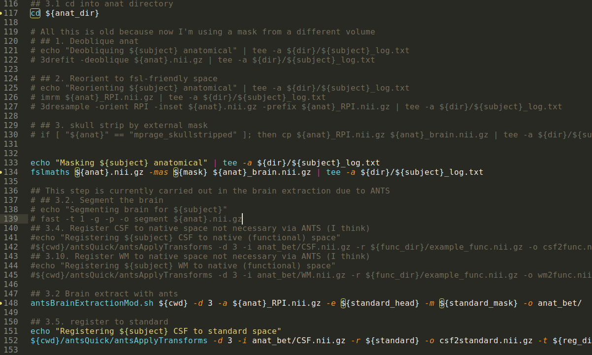

## Does this situation seem familiar to you?

](../fig/phd101212s.png)

### And what about this one?

Did you ever say **I can't work on that project now because my colleague/friend/dog is working on it at the moment, so I need to wait for them to finish their part, before I can continue with mine**. And no, we're not talking about sequential tasks here.

If any of these situations seem familiar, take a deep breath and leave them in your past.
You just needed a **Version Control System** (or VCS, for short) and did not know it.
Not yet, at least.

## What is a version control system?

Version control is a piece of software which allows you to record and
preserve the history of changes made to directories and files.
If you mess things up by mistake, you can retrieve an earlier version of your project.
And if you want to mess things up on purpose, you can do it knowing that everything can be easily reverted.
[Without lines and lines of commented code](https://kentcdodds.com/blog/please-dont-commit-commented-out-code). 
You can even try out different new features, independently, at the same time!

### Why should I be using a VCS?

Avoiding the situations you saw above is the first good reason. Being able to easily access different versions of the same files without having multiple copies that are just *a tad* different from each others has no price.
In addition, VCSs normally store information regarding that difference, not only by letting you see it (`git diff`),
but also by associating changes with a short explanatory message (`git commit`).

VCSs let you switch back and forth from a particular version of a file, or try new features that might not work out in the end - all saving you from commenting a lot of code *because it might be useful in the future or because it might not work after all* 

The perks of using a VCS do not stop here though. If you adopt an online service to store your *repository*, you get a free backup of your files. If you decide to collaborate with other people, you can work on the same project at the same time - VCSs are normally smart enough to help you integrate changes without too much fuzz.

The only downside to VCSs is that they are addictive. Extremely. Like coffee or beer.

### What files/projects can I track using VCS?

The short answer would be: for any kind of file and any sort of projects, really!
The longer answer is that it depends on the VCS and its services. For instance, if you use `git` you might want to avoid any file that is too big (although there are solutions for those as well), and you should preferably track non-binary files (code, LaTeX, html, xml and derivatives like docx, ...), avoiding binaries (programs, older document formats like doc, odt, ...).
Tracking big files might become problematic and slow `git`'s performance. Moreover, some online services based on git have a limit on the size of the repository and of each file you track. As for the binary files, differences become non interpretable (unless you use special platforms built for those type of files), and many times it just register the whole file rather than its part.

This said, using `git` to track your last paper written in LibreOffice, or your last awesome figure built with Inkscape is still a better idea than using nothing!  

### Ok, gotcha. Where can I find those "VCSs" then?

That's a great question. In this workshop, we're going to talk about `git` and GitHub. However, chances are you are already using a VCS without knowing it. Google drive and documents have an integrated VCS. Many other cloud hosting solutions do too!
And did you ever hear about *Wikipedia*? The software it is based upon, *MediaWiki*, has an integrated VCS too. You could consult the changes made to each page if you wanted to!

## Git and GitHub
Once again, `git` and GitHub are going to be the main characters of this workshop. It helps knowing what is the difference between the two though.
`git` is a VCS, a piece of software that let you do awesome tricks - and look more nerdy in the eyes of anyone *not* using it.
GitHub is a web-hosted service based on `git` that complements the VCS with a lot of neat features for community collaboration and software development.

A great way to remember the difference is: GitHub is for `git` what YouTube is for videos.

It is also important to know that `git` is not the only VCS out there (yes, I'm talking about you, Mercurial!) and GitHub is not the only online service based on `git` (gitlab, anyone?)

*'nuff said here. You can continue with the next page or have a look at the [presentation](https://slides.com/ephraim24/a-quick-introduction-to-git-hub).*
